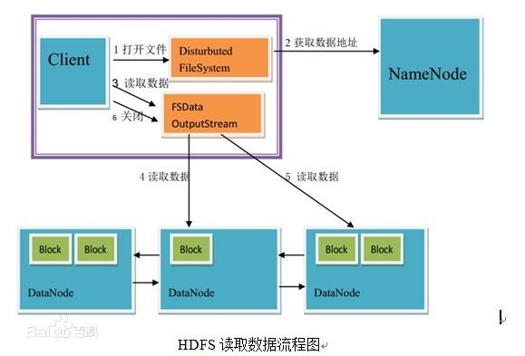
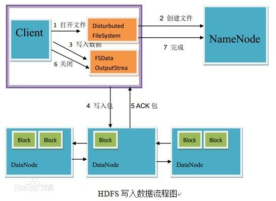
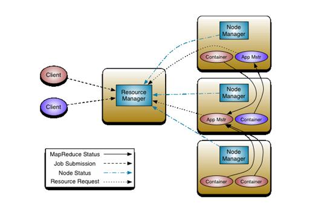

微云（可快速扩充）
====================

大数据-介绍
---------------------

Hadoop由 Apache Software Foundation 公司于 2005 年秋天作为Lucene的子项目Nutch的一部分正式引入。它受到最先由 Google Lab 开发的 Map/Reduce 和 Google File System(GFS) 的启发。

Hadoop这个名字不是一个缩写，而是一个虚构的名字。该项目的创建者，Doug Cutting解释Hadoop的得名 ：“这个名字是我孩子给一个棕黄色的大象玩具命名的。我的命名标准就是简短，容易发音和拼写，没有太多的意义，并且不会被用于别处。小孩子恰恰是这方面的高手。”

Hadoop是一个能够让用户轻松架构和使用的分布式计算平台。用户可以轻松地在Hadoop上开发和运行处理海量数据的应用程序。它主要有以下几个优点：
* 高可靠性。Hadoop按位存储和处理数据的能力值得人们信赖。
* 高扩展性。Hadoop是在可用的计算机集簇间分配数据并完成计算任务的，这些集簇可以方便地扩展到数以千计的节点中。
* 高效性。Hadoop能够在节点之间动态地移动数据，并保证各个节点的动态平衡，因此处理速度非常快。
* 高容错性。Hadoop能够自动保存数据的多个副本，并且能够自动将失败的任务重新分配。
* 低成本。与一体机、商用数据仓库以及QlikView、Yonghong Z-Suite等数据集市相比，hadoop是开源的，项目的软件成本因此会大大降低。

HDFS 对外部客户机而言，HDFS就像一个传统的分级文件系统。可以创建、删除、移动或重命名文件，等等。但是 HDFS 的架构是基于一组特定的节点构建的（参见图 1），这是由它自身的特点决定的。这些节点包括 NameNode（仅一个），它在 HDFS 内部提供元数据服务；DataNode，它为 HDFS 提供存储块。由于仅存在一个 NameNode，因此这是 HDFS 的一个缺点（单点失败）。
存储在 HDFS 中的文件被分成块，然后将这些块复制到多个计算机中（DataNode）。这与传统的 RAID 架构大不相同。块的大小（通常为 64MB）和复制的块数量在创建文件时由客户机决定。NameNode 可以控制所有文件操作。HDFS 内部的所有通信都基于标准的 TCP/IP 协议。

NameNode 是一个通常在 HDFS 实例中的单独机器上运行的软件。它负责管理文件系统名称空间和控制外部客户机的访问。NameNode 决定是否将文件映射到 DataNode 上的复制块上。对于最常见的 3 个复制块，第一个复制块存储在同一机架的不同节点上，最后一个复制块存储在不同机架的某个节点上。注意，这里需要您了解集群架构。
实际的 I/O事务并没有经过 NameNode，只有表示 DataNode 和块的文件映射的元数据经过 NameNode。当外部客户机发送请求要求创建文件时，NameNode 会以块标识和该块的第一个副本的 DataNode IP 地址作为响应。这个 NameNode 还会通知其他将要接收该块的副本的 DataNode。
NameNode 在一个称为 FsImage 的文件中存储所有关于文件系统名称空间的信息。这个文件和一个包含所有事务的记录文件（这里是 EditLog）将存储在 NameNode 的本地文件系统上。FsImage 和 EditLog 文件也需要复制副本，以防文件损坏或 NameNode 系统丢失。
NameNode本身不可避免地具有SPOF（Single Point Of Failure）单点失效的风险，主备模式并不能解决这个问题，通过Hadoop Non-stop namenode才能实现100% uptime可用时间。
DataNode

DataNode 也是一个通常在 HDFS实例中的单独机器上运行的软件。Hadoop 集群包含一个 NameNode 和大量 DataNode。DataNode 通常以机架的形式组织，机架通过一个交换机将所有系统连接起来。Hadoop 的一个假设是：机架内部节点之间的传输速度快于机架间节点的传输速度。
DataNode 响应来自 HDFS 客户机的读写请求。它们还响应来自 NameNode 的创建、删除和复制块的命令。NameNode 依赖来自每个 DataNode 的定期心跳（heartbeat）消息。每条消息都包含一个块报告，NameNode 可以根据这个报告验证块映射和其他文件系统元数据。如果 DataNode 不能发送心跳消息，NameNode 将采取修复措施，重新复制在该节点上丢失的块。

YARN 新的资源管理器全局管理所有应用程序计算资源的分配，每一个应用的 ApplicationMaster 负责相应的调度和协调。一个应用程序无非是一个单独的传统的 MapReduce 任务或者是一个 DAG( 有向无环图 ) 任务。ResourceManager 和每一台机器的节点管理服务器能够管理用户在那台机器上的进程并能对计算进行组织。
事实上，每一个应用的 ApplicationMaster 是一个详细的框架库，它结合从 ResourceManager 获得的资源和 NodeManager 协同工作来运行和监控任务。
上图中 ResourceManager 支持分层级的应用队列，这些队列享有集群一定比例的资源。从某种意义上讲它就是一个纯粹的调度器，它在执行过程中不对应用进行监控和状态跟踪。同样，它也不能重启因应用失败或者硬件错误而运行失败的任务。
ResourceManager 是基于应用程序对资源的需求进行调度的 ; 每一个应用程序需要不同类型的资源因此就需要不同的容器。资源包括：内存，CPU，磁盘，网络等等。可以看出，这同现 Mapreduce 固定类型的资源使用模型有显著区别，它给集群的使用带来负面的影响。资源管理器提供一个调度策略的插件，它负责将集群资源分配给多个队列和应用程序。调度插件可以基于现有的能力调度和公平调度模型。
上图中 NodeManager 是每一台机器框架的代理，是执行应用程序的容器，监控应用程序的资源使用情况 (CPU，内存，硬盘，网络 ) 并且向调度器汇报。
每一个应用的 ApplicationMaster 的职责有：向调度器索要适当的资源容器，运行任务，跟踪应用程序的状态和监控它们的进程，处理任务的失败原因。

### 常用场景1 集群
> 进入到当前目录
> 进入到当前目录
> ## fig up -d && fig ps
### 观察日志(非Mac访问地址为本机的IP地址)
>
* [可以访问 namenode 的管理页面](http://192.168.59.103:50070/) 通过http://192.168.59.103:50070/。
* [可以访问 Yarn 的管理页面](http://192.168.59.103:8088/) 通过 http://192.168.59.103:8088/。
* [可以访问 JobHistory 的管理页面](http://192.168.59.103:19888/) 通过 http://192.168.59.103:19888/。
* [查看在线的节点](http://192.168.59.163:8088/cluster/nodes) 通过 http://192.168.59.163:8088/cluster/nodes。
>
>
* 建立进入容器快捷指令：docker run -v /usr/local/bin:/target jpetazzo/nsenter:latest
* 进入容器：docker-enter cid
* 准备资源
*    su hdfs
*    hdfs dfs -mkdir -p /user/root/input
*    hdfs dfs -mkdir -p hdfs://mynn:8020/user/hdfs/input
*    hdfs dfs -put core-site.xml /user/root/input/
*    hdfs dfs -put core-site.xml hdfs://mynn:8020/user/hdfs/input
*    hdfs dfs -ls /user/root/input/
*    hadoop jar /usr/lib/hadoop-mapreduce/hadoop-mapreduce-examples.jar grep input output 'dfs[a-z.]+'
* 监测端口是否可用
*    nc -v -z -w2 mynn 8020
> ## hadoop示例